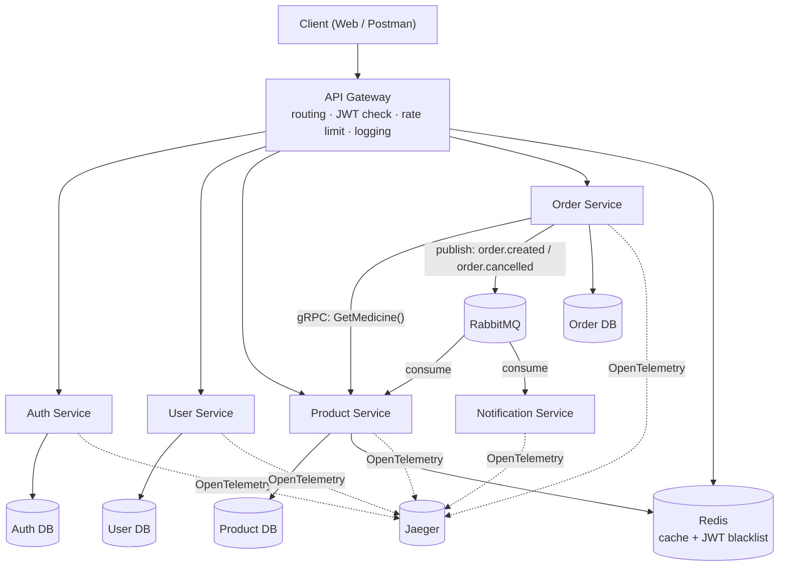
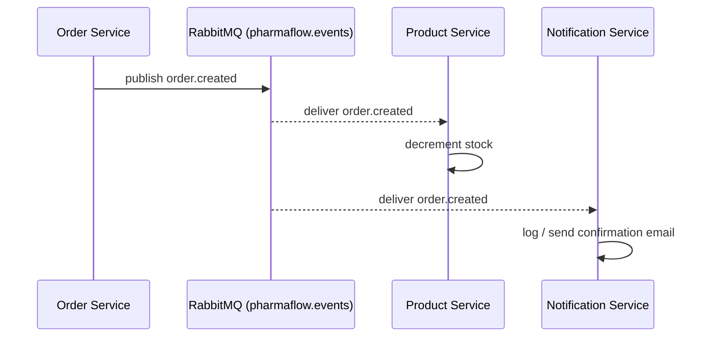

# PharmaFlow — Software Design Document

**A distributed pharmacy ordering & inventory platform**

| | |
|---|---|
| **Version** | 1.0 |
| **Status** | Draft — Design Phase |
| **Author** | Assem Samy Mohsen |
| **Repository** | `pharmaflow/` |

---

## Table of Contents

1. [Overview](#1-overview)
2. [Goals & Non-Goals](#2-goals--non-goals)
3. [System Architecture](#3-system-architecture)
4. [Technology Stack](#4-technology-stack)
5. [Service Catalog](#5-service-catalog)
6. [Data Model & Database-per-Service](#6-data-model--database-per-service)
7. [REST API Specification](#7-rest-api-specification)
8. [Inter-Service Communication (gRPC)](#8-inter-service-communication-grpc)
9. [Event-Driven Architecture (RabbitMQ)](#9-event-driven-architecture-rabbitmq)
10. [API Gateway Design](#10-api-gateway-design)
11. [Authentication & Security](#11-authentication--security)
12. [Caching Strategy (Redis)](#12-caching-strategy-redis)
13. [Observability](#13-observability)
14. [Containerization & Local Development](#14-containerization--local-development)
15. [Repository & Folder Structure](#15-repository--folder-structure)
16. [Implementation Roadmap](#16-implementation-roadmap)
17. [Testing Strategy](#17-testing-strategy)
18. [Risks & Trade-offs](#18-risks--trade-offs)
19. [Future Enhancements](#19-future-enhancements)

---

## 1. Overview

PharmaFlow is a small, deliberately-scoped microservices system that simulates the core
of an online pharmacy: customers search and order medicines, admins manage stock, and
the system keeps inventory consistent and notifies users — all through independently
deployable services communicating over synchronous (gRPC) and asynchronous (RabbitMQ)
channels.

The project exists to demonstrate applied, production-style backend engineering:
service boundaries, database-per-service isolation, event-driven consistency, caching,
observability, and containerized local development — without over-engineering into
infrastructure the domain doesn't need (no Kubernetes, no service mesh, no OAuth
provider, no multi-region concerns).

## 2. Goals & Non-Goals

### Goals
- Demonstrate correct microservice boundaries with independent databases.
- Show both communication styles used in real systems: **gRPC** for synchronous
  service-to-service calls, **RabbitMQ** for asynchronous, decoupled events.
- Demonstrate caching, rate limiting, structured logging, and distributed tracing —
  the "production readiness" signals interviewers look for.
- Ship something a reviewer can `docker compose up` and click through in under five
  minutes.

### Non-Goals
- No Kubernetes, service mesh, or multi-region deployment.
- No real payment processor integration (payments are out of scope entirely for v1).
- No OAuth/SSO provider — JWT-based auth only.
- No horizontal auto-scaling; this is a correctness/architecture demo, not a
  load-bearing production system.

## 3. System Architecture



**Design principle:** every service owns its data. No service reaches into another
service's database. Cross-service reads happen over gRPC (synchronous, needed
immediately) or by reacting to events (asynchronous, eventually consistent).

## 4. Technology Stack

| Layer | Choice | Why |
|---|---|---|
| Runtime | Node.js 20 + Express | Matches existing skill set; fast to iterate |
| Inter-service sync calls | gRPC (`@grpc/grpc-js`, `@grpc/proto-loader`) | Realistic internal contract, strongly typed |
| Async messaging | RabbitMQ (`amqplib`) | Simpler operational model than Kafka for this scale; still shows event-driven design |
| Databases | PostgreSQL (one instance per service, isolated schema/DB) | Relational data (users, orders, stock) with strong consistency needs |
| Cache | Redis | Product search cache, rate limiting, JWT blacklist |
| Auth | JWT (access + refresh tokens), bcrypt for hashing | Enough to demonstrate real auth without OAuth complexity |
| API docs | Swagger / OpenAPI per service | Self-documenting, standard in industry |
| Logging | Pino (structured JSON logs) | Fast, low overhead, easy to pipe into any log stack |
| Tracing | OpenTelemetry SDK + Jaeger | Free, self-hosted, visual trace explorer at `localhost:16686` |
| Containerization | Docker + Docker Compose | One-command local environment |
| CI | GitHub Actions | Lint + test + build on every push, free for public repos |

## 5. Service Catalog

| Service | Responsibility | Owns DB | Exposes |
|---|---|---|---|
| **API Gateway** | Routing, lightweight JWT signature check, rate limiting, request logging, request-ID injection | — | HTTP :3000 |
| **Auth Service** | Register, login, token issue/refresh, logout (blacklist), password hashing | `auth_db` | HTTP :5001, `/docs` |
| **User Service** | User profile CRUD, admin user listing | `user_db` | HTTP :5002, `/docs` |
| **Product Service** | Medicine catalog CRUD, search, stock levels, Redis-cached reads | `product_db` | HTTP :5003, `/docs`, gRPC :6003 |
| **Order Service** | Cart → order creation, order status, calls Product Service via gRPC, publishes order events | `order_db` | HTTP :5004, `/docs` |
| **Notification Service** | Consumes order events, sends (initially console-logged, later email) notifications | none (stateless consumer) | internal only |

Gateway responsibilities are intentionally minimal — routing and cross-cutting
concerns only. Business authorization (e.g. "is this user an admin?") stays inside
the owning service.

## 6. Data Model & Database-per-Service

Each service gets its own PostgreSQL database. No foreign keys across databases —
references are by ID only, resolved via gRPC or replicated via events.

### 6.1 Auth DB

```sql
CREATE TABLE auth_credentials (
    id            UUID PRIMARY KEY DEFAULT gen_random_uuid(),
    email         VARCHAR(255) UNIQUE NOT NULL,
    password_hash VARCHAR(255) NOT NULL,
    role          VARCHAR(20) NOT NULL DEFAULT 'customer', -- customer | admin
    created_at    TIMESTAMPTZ NOT NULL DEFAULT now()
);

CREATE TABLE refresh_tokens (
    id           UUID PRIMARY KEY DEFAULT gen_random_uuid(),
    user_id      UUID NOT NULL REFERENCES auth_credentials(id) ON DELETE CASCADE,
    token_hash   VARCHAR(255) NOT NULL,
    expires_at   TIMESTAMPTZ NOT NULL,
    created_at   TIMESTAMPTZ NOT NULL DEFAULT now()
);
```

### 6.2 User DB

```sql
CREATE TABLE users (
    id          UUID PRIMARY KEY,        -- same value as auth_credentials.id
    full_name   VARCHAR(150) NOT NULL,
    phone       VARCHAR(20),
    address     TEXT,
    created_at  TIMESTAMPTZ NOT NULL DEFAULT now()
);
```

### 6.3 Product DB

```sql
CREATE TABLE medicines (
    id            UUID PRIMARY KEY DEFAULT gen_random_uuid(),
    name          VARCHAR(200) NOT NULL,
    description   TEXT,
    price_cents   INTEGER NOT NULL,
    stock_qty     INTEGER NOT NULL DEFAULT 0,
    requires_rx   BOOLEAN NOT NULL DEFAULT false,
    created_at    TIMESTAMPTZ NOT NULL DEFAULT now(),
    updated_at    TIMESTAMPTZ NOT NULL DEFAULT now()
);

CREATE INDEX idx_medicines_name ON medicines USING gin (to_tsvector('english', name));
```

### 6.4 Order DB

```sql
CREATE TABLE orders (
    id           UUID PRIMARY KEY DEFAULT gen_random_uuid(),
    user_id      UUID NOT NULL,
    status       VARCHAR(20) NOT NULL DEFAULT 'pending', -- pending | confirmed | cancelled
    total_cents  INTEGER NOT NULL,
    idempotency_key VARCHAR(100) UNIQUE,
    created_at   TIMESTAMPTZ NOT NULL DEFAULT now()
);

CREATE TABLE order_items (
    id           UUID PRIMARY KEY DEFAULT gen_random_uuid(),
    order_id     UUID NOT NULL REFERENCES orders(id) ON DELETE CASCADE,
    medicine_id  UUID NOT NULL,
    medicine_name VARCHAR(200) NOT NULL, -- denormalized snapshot at order time
    quantity     INTEGER NOT NULL,
    unit_price_cents INTEGER NOT NULL
);
```

## 7. REST API Specification

All routes below go through the Gateway at `http://localhost:3000`. Full detail lives
in each service's own `/docs` (Swagger UI); this table is the summary contract.

### 7.1 Auth Service — `/api/auth`

| Method | Path | Auth | Description |
|---|---|---|---|
| POST | `/api/auth/register` | none | Create account (email, password, role defaults to `customer`) |
| POST | `/api/auth/login` | none | Returns `{ accessToken, refreshToken }` |
| POST | `/api/auth/refresh` | refresh token | Issue new access token |
| POST | `/api/auth/logout` | access token | Blacklists current token in Redis |

### 7.2 User Service — `/api/users`

| Method | Path | Auth | Description |
|---|---|---|---|
| GET | `/api/users/me` | customer/admin | Current user's profile |
| PUT | `/api/users/me` | customer/admin | Update profile |
| GET | `/api/users` | admin | List all users (paginated) |

### 7.3 Product Service — `/api/products`

| Method | Path | Auth | Description |
|---|---|---|---|
| GET | `/api/products?search=&page=&limit=` | none | Search medicines (Redis-cached) |
| GET | `/api/products/:id` | none | Medicine detail |
| POST | `/api/products` | admin | Add medicine |
| PUT | `/api/products/:id` | admin | Update medicine / stock |
| DELETE | `/api/products/:id` | admin | Remove medicine |

### 7.4 Order Service — `/api/orders`

| Method | Path | Auth | Description |
|---|---|---|---|
| POST | `/api/orders` | customer | Create order (requires `Idempotency-Key` header) |
| GET | `/api/orders/:id` | customer/admin | Order detail |
| GET | `/api/orders` | customer/admin | List own orders (or all, if admin) |
| PATCH | `/api/orders/:id/cancel` | customer/admin | Cancel a pending order |

**Example — create order request:**
```json
POST /api/orders
Headers: Idempotency-Key: 6f1c9e3a-...
{
  "items": [
    { "medicineId": "b2f9...", "quantity": 2 }
  ]
}
```

**Example — response:**
```json
{
  "id": "b93a...",
  "status": "pending",
  "totalCents": 4998,
  "items": [
    { "medicineId": "b2f9...", "medicineName": "Paracetamol 500mg", "quantity": 2, "unitPriceCents": 2499 }
  ],
  "createdAt": "2026-07-28T10:22:00Z"
}
```

## 8. Inter-Service Communication (gRPC)

Used only internally — never exposed to the client. The Order Service calls the
Product Service synchronously to validate medicine existence, price, and current
stock before creating an order.

**`proto/product.proto`**
```protobuf
syntax = "proto3";

package product;

service ProductService {
  rpc GetMedicine (GetMedicineRequest) returns (GetMedicineResponse);
  rpc CheckStock (CheckStockRequest) returns (CheckStockResponse);
}

message GetMedicineRequest {
  string medicine_id = 1;
}

message GetMedicineResponse {
  string id = 1;
  string name = 2;
  int32 price_cents = 3;
  bool requires_rx = 4;
}

message CheckStockRequest {
  string medicine_id = 1;
  int32 quantity = 2;
}

message CheckStockResponse {
  bool available = 1;
  int32 current_stock = 2;
}
```

**Call flow (Order creation):**
```
Order Service
  → gRPC CheckStock(medicineId, qty)   [Product Service]
  ← { available: true, current_stock: 40 }
  → gRPC GetMedicine(medicineId)       [Product Service]
  ← { name, price_cents, requires_rx }
  → persist order + order_items in order_db
  → publish "order.created" event      [RabbitMQ]
```

If `CheckStock` returns `available: false`, the Order Service returns `409 Conflict`
immediately — no event is published, no order is persisted.

## 9. Event-Driven Architecture (RabbitMQ)

**Exchange:** `pharmaflow.events` (type: `topic`)

| Routing key | Publisher | Consumers | Purpose |
|---|---|---|---|
| `order.created` | Order Service | Product Service, Notification Service | Decrement stock; send confirmation |
| `order.cancelled` | Order Service | Product Service, Notification Service | Restore stock; send cancellation notice |

**`order.created` payload:**
```json
{
  "eventId": "b7e2...",
  "eventType": "order.created",
  "occurredAt": "2026-07-28T10:22:00Z",
  "data": {
    "orderId": "b93a...",
    "userId": "3fe1...",
    "items": [
      { "medicineId": "b2f9...", "quantity": 2 }
    ]
  }
}
```

**`order.cancelled` payload:**
```json
{
  "eventId": "d41a...",
  "eventType": "order.cancelled",
  "occurredAt": "2026-07-28T11:05:00Z",
  "data": {
    "orderId": "b93a...",
    "items": [
      { "medicineId": "b2f9...", "quantity": 2 }
    ]
  }
}
```



Each consumer binds its own durable queue to the relevant routing key
(`product.stock.q`, `notification.order.q`), so services can be restarted or scaled
independently without losing events.

## 10. API Gateway Design

The Gateway is a plain Express app using `http-proxy-middleware` — deliberately not a
custom-built reverse proxy, and not Kong/Traefik, to keep the operational surface
small for a solo project.

```
/api/auth/*      → http://auth-service:5001
/api/users/*     → http://user-service:5002
/api/products/*  → http://product-service:5003
/api/orders/*    → http://order-service:5004
```

**Responsibilities:**
- Route requests to the correct service by path prefix.
- Perform a lightweight JWT **signature** check (not full authorization) to reject
  obviously invalid/expired tokens early.
- Attach a `X-Request-Id` header for trace correlation.
- Rate limit per IP + per user (Redis-backed, `rate-limiter-flexible`).
- Log every request (method, path, status, latency) via Pino.

**Explicitly not the Gateway's job:** deciding whether a user is allowed to perform a
specific action (e.g. "is this user an admin who can add medicines?"). That
authorization check stays inside the owning service, which is the sole source of
truth for its own domain.

## 11. Authentication & Security

- **JWT** access tokens (short-lived, ~15 min) + refresh tokens (long-lived, ~7 days,
  stored hashed in `auth_db`).
- **bcrypt** for password hashing (cost factor 12).
- **Logout** blacklists the current access token's `jti` in Redis until its natural
  expiry.
- **Helmet** for standard HTTP security headers.
- **CORS** restricted to known origins.
- **Rate limiting** at the Gateway (see §10) and additionally on `/api/auth/login` to
  slow brute-force attempts.
- **Input validation** via `zod` or `joi` on every service's request bodies.
- **SQL injection protection** via parameterized queries / ORM (Prisma or Knex).
- **Secrets** via `.env` files, never committed; `.env.example` checked in instead.

## 12. Caching Strategy (Redis)

| Use case | Key pattern | TTL | Notes |
|---|---|---|---|
| Product search results | `search:{query}:{page}` | 60s | Invalidated on medicine create/update/delete |
| Product detail | `medicine:{id}` | 5 min | Invalidated on update |
| JWT blacklist (logout) | `blacklist:{jti}` | matches token's remaining TTL | Checked by Gateway on each request |
| Rate limiting counters | `ratelimit:{ip or userId}` | sliding window | via `rate-limiter-flexible` |

**Search flow:**
```
Client → Gateway → Product Service
  → check Redis "search:{q}:{page}"
      hit  → return cached results
      miss → query Postgres → store in Redis → return results
```

## 13. Observability

- **Tracing:** OpenTelemetry SDK auto-instruments Express + gRPC + amqplib in each
  service, exporting spans to **Jaeger** (`localhost:16686`). A single order-creation
  request should show a connected trace across Gateway → Order Service → Product
  Service (gRPC span) → RabbitMQ publish span.
- **Logging:** Pino, structured JSON, one log line per request including
  `requestId`, `service`, `latencyMs`, `statusCode`. Logs are not centralized in v1
  (console/stdout is enough for a local demo) but the structured format means they
  could be shipped to Loki/ELK later without changes.
- **Health checks:** every service exposes `GET /health` returning
  `{ status: "ok", uptime, dependencies: { db: "ok", redis: "ok" } }`.

## 14. Containerization & Local Development

Single `docker-compose.yml` at the repo root brings up the entire system:

```yaml
services:
  gateway:        { build: ./gateway,               ports: ["3000:3000"] }
  auth-service:   { build: ./auth-service,           ports: ["5001:5001"] }
  user-service:   { build: ./user-service,           ports: ["5002:5002"] }
  product-service:{ build: ./product-service,        ports: ["5003:5003", "6003:6003"] }
  order-service:  { build: ./order-service,          ports: ["5004:5004"] }
  notification-service: { build: ./notification-service }

  postgres:  { image: postgres:16, ports: ["5432:5432"] }
  redis:     { image: redis:7,     ports: ["6379:6379"] }
  rabbitmq:  { image: rabbitmq:3-management, ports: ["5672:5672", "15672:15672"] }
  jaeger:    { image: jaegertracing/all-in-one, ports: ["16686:16686"] }
```

`docker compose up` is the entire onboarding story for a reviewer — no manual DB
setup, no local Node/Postgres install required.

## 15. Repository & Folder Structure

```
pharmaflow/
├── docs/
│   └── SDD.md                  (this document)
├── gateway/
│   ├── src/
│   │   ├── routes/
│   │   ├── middlewares/        (auth-check, rate-limit, logging)
│   │   └── config/
│   └── Dockerfile
├── auth-service/
│   ├── src/
│   │   ├── controllers/
│   │   ├── routes/
│   │   ├── middlewares/
│   │   ├── database/
│   │   ├── models/
│   │   └── utils/
│   └── Dockerfile
├── user-service/          (same internal layout as auth-service)
├── product-service/
│   ├── src/
│   │   ├── controllers/
│   │   ├── routes/
│   │   ├── grpc/            (server + generated stubs)
│   │   ├── events/           (consumers)
│   │   ├── database/
│   │   └── utils/
│   └── Dockerfile
├── order-service/
│   ├── src/
│   │   ├── controllers/
│   │   ├── routes/
│   │   ├── grpc/             (client)
│   │   ├── events/            (publishers)
│   │   ├── database/
│   │   └── utils/
│   └── Dockerfile
├── notification-service/
│   ├── src/
│   │   └── events/            (consumers)
│   └── Dockerfile
├── proto/
│   └── product.proto
├── docker-compose.yml
├── .env.example
└── README.md
```

## 16. Implementation Roadmap

| Phase | Deliverable |
|---|---|
| **1 — Foundations** | Docker Compose skeleton: Postgres, Redis, RabbitMQ, Jaeger, empty Gateway. No business logic yet. |
| **2 — Auth Service** | Register, login, JWT issue, refresh, logout/blacklist. |
| **3 — Product Service** | Medicine CRUD, search, Redis caching. |
| **4 — Order Service** | Order creation calling Product Service via gRPC; publish `order.created` / `order.cancelled`. |
| **5 — Notification Service** | Consume events; log to console first, wire up email later. |
| **6 — Swagger** | `/docs` on every HTTP service. |
| **7 — Gateway hardening** | JWT signature check, rate limiting, request-ID injection, logging. |
| **8 — Observability** | OpenTelemetry + Jaeger wired into all services; Pino structured logging. |
| **Stretch (optional)** | Refresh-token rotation, API versioning (`/api/v1`), health-check endpoints, idempotency keys (already in schema), pagination polish. |

Estimated timeline: 3–5 weeks part-time, in the phase order above — each phase
produces something runnable, so the project is demo-able at every stage, not just at
the end.

## 17. Testing Strategy

| Level | Tool | Scope |
|---|---|---|
| Unit | Jest | Business logic per service (pricing, stock checks, validators) |
| Integration | Jest + Supertest | HTTP endpoints per service against a test DB (via `docker-compose.test.yml` or Testcontainers) |
| Contract | Manual / Postman collection | Verifies gRPC and event payload shapes match this document |
| CI | GitHub Actions | Lint (ESLint) + unit tests on every push/PR, per service |

## 18. Risks & Trade-offs

- **Eventual consistency on stock:** between `order.created` being published and the
  Product Service consuming it, stock isn't yet decremented. Mitigated by the
  synchronous gRPC `CheckStock` call at order-creation time, which catches the common
  case; a rare race under high concurrency is an accepted trade-off for this project's
  scope (documented, not silently ignored — a real system would add optimistic
  locking or a reservation step).
- **No distributed transaction/saga:** if stock decrement fails after the order is
  persisted, the system currently has no automatic compensating action beyond what
  `order.cancelled` provides manually. Called out here rather than solved, to keep
  scope honest.
- **Single Postgres instance hosting multiple databases:** acceptable for a local/demo
  deployment; a production system would run separate instances per service.

## 19. Future Enhancements

- Saga pattern (or outbox pattern) for stronger cross-service consistency guarantees.
- Real email/SMS provider integration for notifications.
- Prometheus + Grafana dashboards alongside the existing Jaeger tracing.
- API versioning and a deprecation policy once a v2 is needed.
- Horizontal scaling demo (multiple Order Service replicas behind the Gateway).

---

*This document describes the intended design. Implementation details may evolve as
each phase is built — deviations should be reflected back into this file so it stays
the single source of truth for the architecture.*
