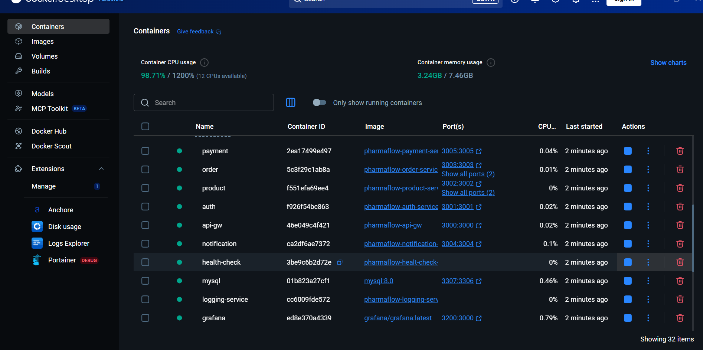
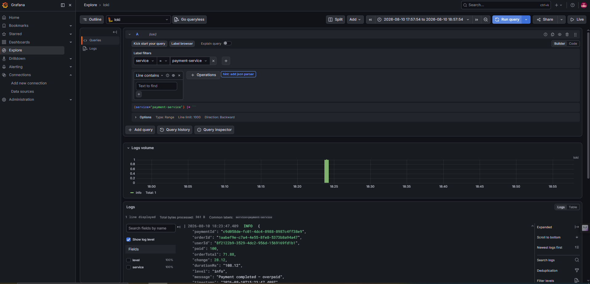
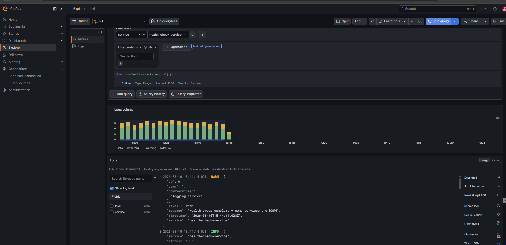
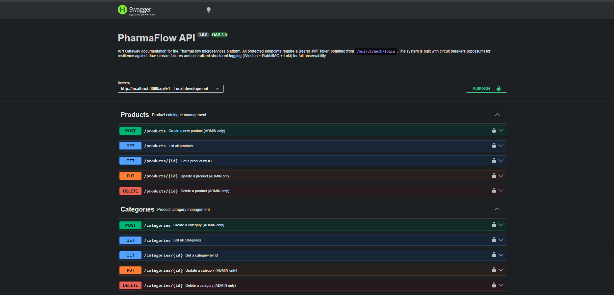

# PharmaFlow — Backend Monorepo

A production-ready **microservices backend** for a pharmaceutical e-commerce platform. Built with Node.js / Express, using synchronous gRPC calls, asynchronous RabbitMQ event-driven communication, circuit breakers for resilience, and a centralized structured logging pipeline feeding Grafana Loki.

---

## Table of Contents

- [Running the Project](#running-the-project)
  - [Option A: Local Development (Cloud Databases)](#option-a-local-development-cloud-databases)
  - [Option B: Logging Stack Only (Docker Compose)](#option-b-logging-stack-only-docker-compose)
- [Architecture Overview](#architecture-overview)
- [Testing & CI/CD](#testing--cicd)
  - [Unit Tests](#unit-tests)
  - [Integration Tests](#integration-tests)
  - [GitHub Actions Pipeline](#github-actions-pipeline)
- [Design Decisions — Why Each Concept](#design-decisions--why-each-concept)
  - [Redis Cache Invalidation](#redis-cache-invalidation)
  - [Circuit Breakers](#circuit-breakers-opossum)
  - [Centralized Logging Pipeline](#centralized-logging-pipeline)
  - [Health Check Service](#health-check-service-why)
  - [Payment Service — Clean Layered Logic](#payment-service--clean-layered-logic)
- [Observability — Centralized Logging](#observability--centralized-logging)
- [Resilience — Circuit Breakers](#resilience--circuit-breakers)
- [Services](#services)
  - [API Gateway](#1-api-gateway-api-gw)
  - [Auth Service](#2-auth-service)
  - [Product Service](#3-product-service)
  - [Order Service](#4-order-service)
  - [Payment Service](#5-payment-service)
  - [Notification Service](#6-notification-service)
  - [Logging Service](#7-logging-service)
  - [Health Check Service](#8-health-check-service)
- [Communication Patterns](#communication-patterns)
  - [RabbitMQ — Async Event Bus](#rabbitmq--async-event-bus)
  - [gRPC — Synchronous Internal Calls](#grpc--synchronous-internal-calls)
- [Shared Proto Definitions](#shared-proto-definitions)
- [Project Structure](#project-structure)

---

## Running the Project

### Option A: Local Development (Cloud Databases)

This option uses your local Node.js environment while connecting to the remote managed databases (Neon, Railway, MongoDB Atlas, Upstash Redis, etc.) configured in each service's `.env` file.

**Prerequisites:**
- Node.js (v20+)
- Local RabbitMQ instance running on `amqp://localhost`
- *(Optional)* Docker Desktop — required only to run Loki + Grafana for observability

**Steps:**
1. Open a terminal for each service and run:
   ```bash
   npm install
   npm run dev
   ```
2. Start services in this order: `logging-service` → all others.
3. The API Gateway will be available at `http://localhost:3000/api/v1`.
4. Swagger UI is available at `http://localhost:3000/api/v1/docs`.

*(Note: Because this uses remote cloud databases, you may experience higher latency during local development depending on your geographical location.)*

### Option B: Logging Stack Only (Docker Compose)

Spin up **only** Loki and Grafana without starting the full application stack. This is the recommended way to enable observability during local development.

**Prerequisites:**
- Docker and Docker Compose installed.

**Steps:**
```bash
docker compose -f docker-compose.logging.yml up -d
```

| Service | URL |
|---------|-----|
| Grafana UI | `http://localhost:3001` (admin / admin) |
| Loki HTTP API | `http://localhost:3100` |

After starting, **add Loki as a data source in Grafana:**
1. Go to **Connections → Data Sources → Add data source → Loki**.
2. Set URL to `http://loki:3100`.
3. Click **Save & test**.

Then use the **Explore** tab with a LogQL query like `{service="payment-service"}` to view structured logs.

### Option C: Full Local Development (Docker Compose — Recommended)

This is the recommended approach for full local development. It spins up local instances of PostgreSQL, MySQL, MongoDB, Redis, RabbitMQ, Grafana, and Loki along with all the microservices in a unified Docker network.

**Steps:**
1. Ensure Docker Desktop is running.
2. From the root of the project, run:
   ```bash
   docker compose up -d --build
   ```
3. Docker will automatically provision the databases, mount the `proto` directory for gRPC, and run `npx prisma db push` to initialize the database schemas before starting the Node.js services.
4. The API Gateway will be available at `http://localhost:3000/api/v1`.
5. Swagger UI is available at `http://localhost:3000/api/v1/docs`.



---

## Architecture Overview

```
                        ┌──────────────────────────────────────────────────────────────┐
                        │                        API Gateway                            │
                        │  :3000  |  Rate Limiting  |  JWT Verify  |  Swagger  |  CBs  │
                        └──────────────────┬───────────────────────────────────────────┘
                                           │  HTTP proxy (axios + opossum circuit breakers)
         ┌─────────────────────────────────┼────────────────────────────────────────────┐
         │                                 │                                            │
         ▼                                 ▼                                            ▼
  ┌─────────────┐               ┌──────────────────┐                       ┌──────────────────┐
  │ Auth Service│               │ Product Service   │                       │  Order Service   │
  │  (Prisma)   │               │ (Prisma+Redis)    │                       │    (Prisma)      │
  │  gRPC: 50053│               │  gRPC Server:50051│◄──── gRPC ────────── │  gRPC Server:50052│
  └─────────────┘               └──────────────────┘                       └──────────────────┘
                                         ▲                                           │
                                         │              ┌────────────────────────────┘
                                         │              │
                                ┌─────────────────┐    │        ┌──────────────────┐
                                │    RabbitMQ     │◄───┘        │  Payment Service │
                                │ pharmaflow.     │             │   (Prisma/MySQL) │
                                │   events        │◄─payment.*──│  gRPC Client     │
                                │  (topic exch.)  │             └──────────────────┘
                                └─────────────────┘
                                   │          │
                      order.*      │          │  payment.*
                      ┌────────────┘          └───────────────┐
                      ▼                                       ▼
             ┌────────────────┐                    ┌──────────────────┐
             │ Product Service│                    │ Notification Svc │
             │ stockConsumer  │                    │   (MongoDB)      │
             └────────────────┘                    └──────────────────┘

                        ── Centralized Logging Pipeline ──

  Each service (Winston logger)
         │
         │  channel.publish  (pharmaflow.logs fanout exchange)
         ▼
  ┌─────────────────┐      consume      ┌──────────────────┐     HTTP push    ┌──────────────┐
  │    RabbitMQ     │ ──────────────►  │  logging-service  │ ────────────►   │  Grafana Loki│
  │ pharmaflow.logs │                   │   (batch=50,      │                  │  :3100       │
  │  (fanout exch.) │                   │  flush=2000ms)    │                  └──────────────┘
  └─────────────────┘                   └──────────────────┘                         │
                                                                                     ▼
                                                                             ┌──────────────┐
                                                                             │   Grafana UI │
                                                                             │   :3001      │
                                                                             └──────────────┘
```

---

## Testing & CI/CD

The project ships with a fully automated, two-stage testing pipeline that runs on every push to any branch via **GitHub Actions**.

### Unit Tests

Each microservice has its own isolated unit test suite using **[Vitest](https://vitest.dev/)** — chosen over Jest for its native, configuration-free ESM support (`"type": "module"`).

**Framework:** Vitest v3 with `@vitest/coverage-v8`  
**Mocking strategy:** `vi.mock()` is used to mock all external dependencies at the module level (Prisma models, gRPC clients, RabbitMQ publishers, Redis) so tests run instantly with zero infrastructure.

| Service | Tests | What's covered |
|---|---|---|
| `auth-service` | 13 | Login bloom-filter fast-path, register validation, updateAccount, deleteAccount, getAllUsers |
| `payment-service` | 15 | `_calculateAmounts` pure math (exact/under/over-payment, float precision), `createPayment` guard paths, idempotency replay, budget deduction, `getMyPayments` |
| `product-service` | 16 | Cache HIT/MISS/invalidation on all CRUD operations for both Products and Categories |
| `order-service` | 12 | Idempotency replay, circuit-breaker 503 fallback, stock reservation 409, success creation with event publishing, delete stock-restore logic, cancellation events |
| `notification-service` | 9 | Cursor-based pagination (sentinel doc detection, limit capping, cursor `$lt` filter), getById, deleteById |
| `api-gw` | 10 | HTTP method/URL/header/body forwarding, `x-current-user` header injection, downstream HTTP error propagation across all 5 downstream services |
| **Total** | **75** | **100% passing** |

**Running locally:**
```bash
# From any service directory:
npm test

# With coverage report:
npm run test:coverage
```

**Path alias:** Each `vitest.config.js` maps `@/` → `src/` so test imports never break due to directory nesting.
```js
// Instead of fragile: ../../src/service/authService.js
import { AuthService } from "@/service/authService.js";
```

---

### Integration Tests

Located in `tests/integration/`, these tests run against the **full live Docker Compose stack** and fire real HTTP requests at the API Gateway. No mocks — every call traverses the complete request path: `Client → API Gateway → Service → Database`.

**Test file:** `tests/integration/auth.test.js`

| Suite | Tests | What's verified |
|---|---|---|
| Health checks | 1 | API Gateway is reachable |
| Auth flow | 6 | Register ADMIN + CUSTOMER, login, wrong password → 401, ghost email → 404, duplicate → 400 |
| Protected routes | 2 | Unauthenticated GET /products and GET /orders → 401 |
| Category flow | 4 | CUSTOMER blocked (403), ADMIN creates, duplicate name → 400, list all |
| Product flow | 6 | CUSTOMER blocked (403), ADMIN creates (with real categoryId UUID), GET all/by-id, 404 on ghost UUID, ADMIN updates |
| Order flow | 7 | Create order (real productId via gRPC stock reserve), idempotency replay, list customer orders, 403 on other user's orders, GET by id, 404 ghost, cancel → CANCELLED, delete |
| Notifications | 2 | GET my notifications → 200, invalid ObjectId → 400/404 |
| Payments | 2 | GET my payments, GET payments by order |
| **Total** | **31** | **100% passing** |

Test state flows sequentially — the `categoryId` created in the category test is used to create a product, which is then used to create an order, ensuring every step is validated against real data.

---

### GitHub Actions Pipeline

Defined in `.github/workflows/ci.yml`. Triggers automatically on every push to any branch.

```
┌─────────────────────────────────────────────────────────────────────────┐
│  Stage 1 — Unit Tests  (parallel, all services at once)                 │
│                                                                         │
│  auth-service  payment-service  product-service  order-service          │
│  notification-service  api-gw                                           │
│                                                                         │
│  → npm ci → npm test (vitest run)                                       │
└─────────────────────────────────────────────────────────────────────────┘
                              │
              Only if ALL unit jobs pass
                              │
                              ▼
┌─────────────────────────────────────────────────────────────────────────┐
│  Stage 2 — Integration Tests  (gated)                                   │
│                                                                         │
│  1. Write .env from ENV_FILE GitHub secret                              │
│  2. docker compose up -d --build --wait  (waits for health checks)      │
│  3. npm ci && npm test  (fires HTTP at live API Gateway)                │
│  4. On failure: dump docker logs → upload as CI artifact                │
│  5. Always: docker compose down -v                                      │
└─────────────────────────────────────────────────────────────────────────┘
```

**Key design decisions:**
- `fail-fast: false` on the unit test matrix — all 6 services are reported even if one fails, so you see the full picture.
- `needs: unit-tests` on the integration job — integration tests never run if any unit test is broken.
- `docker compose up --wait` — waits for every service's health check to pass before firing requests.
- Docker logs are uploaded as a CI artifact on failure for post-mortem debugging.
- The `ENV_FILE` secret holds the entire `.env` file content — set it in **GitHub → Settings → Secrets → Actions**.

---

 — Why Each Concept

### Redis Cache Invalidation

**Problem:** Product reads are frequent (every page load, search, order creation), but product writes are rare (admin only). Without caching, every read hits PostgreSQL, increasing latency and DB load unnecessarily.

**Why cache-aside with fire-and-forget invalidation?**
- On a `GET /products/:id`, the service checks Redis first. On a cache hit, the response is returned in sub-millisecond time — no DB round-trip.
- On a cache miss, the DB is queried and the result is written back to Redis asynchronously (fire-and-forget), so the client doesn't wait for the cache write.
- On any write (`POST`, `PUT`, `DELETE`), the cache key is **deleted** (invalidated) rather than updated. This avoids the "cache stampede" problem and keeps the logic simple: the next read will re-populate from DB.

**Why delete instead of update?** Updating the cache during a write requires the write path and read path to agree on the exact serialization format. Deleting is simpler, safer, and guarantees the cache is never stale.

---

### Circuit Breakers (Opossum)

**Problem:** In a microservice architecture, a slow or crashed downstream service (e.g. `auth-service`) will cause upstream callers to hang and accumulate blocked threads/connections. This cascading failure can take down the entire system.

**Why circuit breakers?**
- A circuit breaker wraps a network call and tracks its success/failure rate.
- **CLOSED** → everything normal, requests pass through.
- **OPEN** → after the error threshold is breached, the breaker stops making real calls and returns a fallback immediately (`503`). This gives the downstream service time to recover without being hammered.
- **HALF-OPEN** → after a reset timeout, one probe request is allowed through. If it succeeds, the circuit closes; if not, it opens again.

**Why `errorFilter` that ignores 4xx?**
A `404 Order Not Found` or `409 Conflict` is a **business logic error**, not an infrastructure failure. Without `errorFilter`, these would count toward the failure threshold and trip the breaker incorrectly. Only `5xx`, timeouts, and `ECONNREFUSED` should count.

**Why sentinel fallback objects instead of throwing?**
Throwing inside an opossum fallback bypasses the `fire()` promise and causes an unhandled rejection crash. Returning a sentinel (`{ __circuitOpen: true }`) lets the calling service detect the open circuit gracefully and return a clean `503` to the client.

---

### Centralized Logging Pipeline

**Problem:** When you have 7+ microservices all logging to their own stdout/files, debugging a cross-service request (e.g. an order that failed payment) means SSH-ing into multiple servers and grepping through scattered files. This is not scalable.

**Why RabbitMQ → Loki pipeline?**
- Every service uses a shared **Winston** logger with a custom RabbitMQ transport. Logs are published as structured JSON to a `pharmaflow.logs` **fanout exchange** — fire-and-forget, non-blocking.
- The **logging-service** is the sole consumer. It batches messages and pushes them to **Grafana Loki** in a single HTTP call grouped by `{ service, level }` stream labels.
- In **Grafana**, you can query across all services simultaneously: `{service=~"payment-service|order-service"} |= "orderId"` — instantly correlating events across service boundaries.



**Why a fanout exchange for logs?**
Fanout delivers a copy of every log to every bound queue. This means you can add a second logging consumer (e.g. an alerting service) without changing any producer code.

**Why PID-scoped exclusive queues?**
On Windows with nodemon, restarting a service leaves "zombie" processes that still own their queue. A new process trying to consume from the same named queue gets blocked. By naming queues `logs-<pid>` and marking them `exclusive: true` (auto-delete on disconnect), each process always gets a fresh, uncontested queue.

---

### Health Check Service — Why

**Problem:** With 7 microservices running independently, it's impossible to know at a glance which services are up or down without manually hitting each endpoint. When a service goes down silently, the first sign is often a flood of user-facing errors.

**Why a dedicated health-check service?**
- It runs a sweep every **30 seconds** across all services concurrently (`Promise.allSettled`), so one DOWN service never blocks the others.
- Results are logged as structured JSON via the same Winston → RabbitMQ → Loki pipeline. This means you can query Grafana for `{service="health-check-service"} |= "DOWN"` and see exactly when a service went offline and how long it was down.
- Each service exposes a `GET /health` endpoint registered directly on the Express `app` (not inside the versioned router), so it bypasses JWT auth and works regardless of business-logic state.
- `Promise.allSettled` is used instead of `Promise.all` so a single service timeout (5s) never cancels the entire sweep.



---

### Payment Service — Clean Layered Logic

**Problem:** The original `createPayment` method was ~170 lines — it fetched and validated the order, calculated payment amounts, checked idempotency, deducted budget via gRPC, wrote to DB, published events, and handled rollbacks, all in one flat function. This is a classic "God function" — impossible to test in isolation, hard to reason about, and fragile to change.

**Solution — private helper methods:**
The `PaymentService` class now delegates each concern to a named private method:

| Method | Responsibility |
|--------|---------------|
| `_fetchAndValidateOrder` | gRPC call + circuit breaker + ownership/status checks |
| `_calculateAmounts` | Pure math — shortfall, overpayment, flags |
| `_checkIdempotency` | Duplicate key detection + inline pending-refund reconciliation |
| `_deductBudget` | gRPC call to auth-service with circuit breaker |
| `_processPaymentSuccess` | DB write + event publishing |
| `_handlePaymentFailure` | Budget rollback + failure audit record + failure event |

The main `createPayment` now reads like a numbered checklist of the business flow. Each helper is independently understandable and can be unit-tested by passing mock data directly.

---

## Observability — Centralized Logging

All services use a shared **Winston** logger (`src/utils/logger.js`) with two transports:

| Transport | Purpose |
|-----------|---------|
| **Console** | Pretty-printed, colourised output during local development |
| **RabbitMQ** | Publishes structured JSON to the `pharmaflow.logs` fanout exchange |

The **logging-service** is a dedicated Node.js consumer that:
1. Pulls messages from its own exclusive, PID-scoped queue (e.g. `logs-16640`).
2. Buffers them in memory up to `BATCH_SIZE=50` or `FLUSH_INTERVAL_MS=2000ms`.
3. Pushes the entire batch to Grafana Loki in a single HTTP call grouped by `{ service, level }` stream labels.

**Key design decisions:**
- **Fanout exchange** — every consumer (even multiple instances) gets its own copy of every log.
- **Exclusive + PID-scoped queue** — each `logging-service` process owns a private queue that auto-deletes on disconnect, preventing Windows/nodemon zombie processes from stealing messages.
- **Batch-ack** — a single RabbitMQ ack frame covers all messages in the flushed batch.
- **nack + requeue on Loki failure** — if Loki is unreachable, logs are re-queued and retried.
- **Non-blocking** — Winston transport callback is called immediately; publish is fire-and-forget.
- **Circular-ref safe** — `JSON.stringify` is wrapped in `try/catch`; un-serializable payloads print a warning instead of crashing.

**Logged events (selected):**

| Service | Level | Event |
|---------|-------|-------|
| `payment-service` | `info` | Payment completed (success / overpaid / refunded) |
| `payment-service` | `warn` | Circuit breaker open/fallback, budget deduction failed |
| `order-service` | `info` | Order created, status changed |
| `order-service` | `warn` | Circuit breaker events, stock reservation failure |
| `auth-service` | `warn` | Failed login attempt, unauthorized access |

---

## Resilience — Circuit Breakers

All inter-service HTTP calls in the **API Gateway** and the **Order/Payment services** are wrapped with **opossum** circuit breakers.

### Configuration (`.env`)

```env
CB_TIMEOUT=3000        # ms before a call is considered failed
CB_ERROR_THRESHOLD=50  # % error rate to trip the circuit
CB_RESET_TIMEOUT=10000 # ms before the circuit probes again (HALF-OPEN)
```

### API Gateway behaviour

| Scenario | Circuit State | Client receives |
|----------|---------------|-----------------|
| Downstream returns 4xx (e.g. 409 Conflict, 400 Bad Request) | **Stays CLOSED** — business errors do not count as failures | Original `4xx` status + body |
| Downstream returns 5xx or is unreachable | **Counts toward threshold** | `503 Service Unavailable` once open |
| Circuit is OPEN | **Fast-fail** — no call made | `503 { message: "<service> is currently unavailable" }` |

**Key implementation detail:** The opossum `errorFilter` ignores `4xx` responses so that business logic errors (duplicate idempotency keys, order not in pending state, etc.) never trip the circuit. Only genuine infrastructure failures (5xx, `ECONNREFUSED`, timeouts) count.

**Fallback safety:** Opossum fallback functions **always return** a plain sentinel object — they never `throw`. Throwing inside a fallback bypasses the `fire()` promise chain and causes an unhandled rejection crash. The calling layer reads the sentinel and throws a clean, non-circular error that the controller can safely serialize.

---

## Services

### 1. API Gateway (`api-gw`)

The single entry point for all client traffic. No business logic lives here — it proxies requests to downstream services after authentication.

**Port:** `3000`  
**Base path:** `/api/v1`

#### Responsibilities
- **JWT verification** — `verifyToken` middleware validates the Bearer token on all protected routes and injects an `x-current-user` header with the decoded payload before forwarding.
- **Rate limiting** — 100 requests per 5-minute window per IP (`express-rate-limit`).
- **Security headers** — `helmet` applied globally.
- **Circuit breakers** — one `opossum` breaker per downstream service with shared config from `.env`.
- **Swagger UI** — Full OpenAPI 3.0 docs served at `/api/v1/docs` (raw JSON at `/api/v1/docs.json`).



#### Routes (proxied)

| Method | Gateway Path | Forwards To |
|--------|-------------|-------------|
| `POST` | `/api/v1/auth/register` | `auth-service` |
| `POST` | `/api/v1/auth/login` | `auth-service` |
| `*` | `/api/v1/products` | `product-service` |
| `*` | `/api/v1/categories` | `product-service` |
| `*` | `/api/v1/orders/*` | `order-service` |
| `*` | `/api/v1/notifications/*` | `notification-service` |
| `*` | `/api/v1/payments/*` | `payment-service` |
| `GET` | `/api/v1/health` | inline health check |

---

### 2. Auth Service

Handles user identity — registration, login, and account management.

**Port:** `3010` (internal)  
**Internal base path:** `/auth-service/api/v1`  
**Database:** PostgreSQL via **Prisma**

#### Key Features
- **Bloom filter** — seeded with all existing emails at startup to provide O(1) duplicate-email detection before hitting the database.
- **Zod validation** — `validateRegister` / `validateLogin` middleware reject malformed payloads early.
- **JWT issuance** — returns a signed token on successful login/register.
- **Structured logging** — failed login attempts and unauthorised access logged as `warn` to Loki.

#### Endpoints

| Method | Path | Access | Description |
|--------|------|--------|-------------|
| `POST` | `/register` | Public | Create a new user account |
| `POST` | `/login` | Public | Authenticate and receive JWT |
| `PUT` | `/update` | Auth | Update account details |
| `DELETE` | `/delete` | Auth | Delete account |
| `GET` | `/users` | Admin | List all users |

---

### 3. Product Service

Manages the pharmaceutical product catalogue and categories.

**Port:** `3002` (HTTP), `50051` (gRPC)  
**Internal base path:** `/product-service/api/v1`  
**Database:** PostgreSQL via **Prisma**  
**Cache:** Redis (cache-aside pattern)

#### Key Features
- **Redis caching** — `cacheService` wraps product reads with fire-and-forget invalidation.
- **gRPC server** — exposes `ProductService` for internal stock reservation calls from the Order service.
- **RabbitMQ consumer** — `startStockConsumer()` listens on two queues:

| Queue | Routing Key(s) | Action |
|-------|---------------|--------|
| `stock.restore` | `order.cancelled`, `order.deleted` | Restores stock in bulk |
| `stock.adjust` | `order.item.updated` | Adjusts stock deltas |

#### Endpoints

| Method | Path | Access | Description |
|--------|------|--------|-------------|
| `POST` | `/categories` | ADMIN | Create category |
| `PUT` | `/categories/:id` | ADMIN | Update category |
| `DELETE` | `/categories/:id` | ADMIN | Delete category |
| `GET` | `/categories` | Auth | List categories |
| `GET` | `/categories/:id` | Auth | Get category |
| `POST` | `/products` | ADMIN | Create product |
| `PUT` | `/products/:id` | ADMIN | Update product |
| `DELETE` | `/products/:id` | ADMIN | Delete product |
| `GET` | `/products` | Auth | List products |
| `GET` | `/products/:id` | Auth | Get product |

---

### 4. Order Service

Manages the full order lifecycle from placement through confirmation/cancellation.

**Port:** `3003` (HTTP), `50052` (gRPC)  
**Internal base path:** `/order-service/api/v1`  
**Database:** PostgreSQL via **Prisma**

#### Key Features
- **Circuit breakers** — `opossum` breakers wrap all gRPC calls to `product-service`. Circuit state changes are logged to Loki as structured `warn`/`info` events.
- **gRPC client** — calls `ProductService.CheckAndReserveStock` synchronously on order creation.
- **gRPC server** — exposes `OrderService.GetOrderById` for the Payment service.
- **RabbitMQ publisher** — publishes lifecycle events to `pharmaflow.events`.
- **RabbitMQ consumer** — listens on `orders.payments` queue for `payment.success` / `payment.failed`.
- **Cursor-based pagination** — O(log n) order listings.
- **Structured logging** — order creation, status changes, and circuit breaker events logged to Loki.

#### Key RabbitMQ Events Published

| Routing Key | Trigger |
|-------------|---------|
| `order.placed` | Order created |
| `order.cancelled` | Order cancelled |
| `order.deleted` | Order hard-deleted |
| `order.item.updated` | Item quantity decreased |
| `order.updated` | Any status change |

#### Endpoints

| Method | Path | Access | Description |
|--------|------|--------|-------------|
| `POST` | `/orders` | Auth | Place a new order |
| `PUT` | `/orders/:id` | Auth | Update order / items |
| `DELETE` | `/orders/:id` | Auth | Cancel / delete order |
| `GET` | `/orders/customer/:id` | Auth | List orders for a customer |
| `GET` | `/orders/:id` | Auth | Get a single order |
| `GET` | `/orders` | ADMIN | List all orders |

---

### 5. Payment Service

Processes payments against existing orders.

**Port:** `3005` (HTTP)  
**Internal base path:** `/payment-service/api/v1`  
**Database:** MySQL via **Prisma**

#### Key Features
- **Circuit breakers** — `opossum` wraps gRPC calls to `order-service` and HTTP budget calls to `auth-service`. Circuit state changes are logged to Loki.
- **gRPC client** — calls `OrderService.GetOrderById` to verify order existence, ownership, and `PENDING` status before creating a payment.
- **Idempotency** — duplicate payment requests with the same key return the existing payment record.
- **Overpayment handling** — if `amount > order.total`, a `payment.overpaid` event is published and the change is returned in the response.
- **Refund sweep** — a cron job runs every 5 minutes to process pending refunds.
- **RabbitMQ publisher** — publishes payment outcome events.
- **Structured logging** — payment success, failure, and rollback events logged to Loki with full financial metadata.

#### Key RabbitMQ Events Published

| Routing Key | Trigger |
|-------------|---------|
| `payment.success` | Payment record created successfully |
| `payment.failed` | DB write error |
| `payment.overpaid` | Amount exceeds order total |
| `payment.refunded` | Refund processed |

#### Endpoints

| Method | Path | Access | Description |
|--------|------|--------|-------------|
| `POST` | `/` | Auth | Create a payment for an order |
| `GET` | `/me` | Auth | List my payments |
| `GET` | `/order/:orderId` | Auth | Get payments for a specific order |
| `GET` | `/:id` | Auth | Get a single payment |

---

### 6. Notification Service

Persists in-app notifications triggered by order and payment lifecycle events.

**Port:** `3004`  
**Internal base path:** `/notifications-service/api/v1`  
**Database:** MongoDB via **Mongoose**

#### Key Features
- **RabbitMQ consumer** — `startNotificationConsumer()` uses a single durable queue bound to all relevant routing keys. Processed in a clean `TYPE_MAP` + `MESSAGE_BUILDERS` lookup pattern.
- **Cursor-based pagination** — O(log n) for notification lists.

#### Endpoints

| Method | Path | Access | Description |
|--------|------|--------|-------------|
| `GET` | `/notifications?cursor=&limit=` | Auth | Paginated notifications for logged-in user |
| `GET` | `/notifications/:id` | Auth | Get a single notification |
| `DELETE` | `/notifications/:id` | Auth | Delete a notification |

---

### 7. Logging Service

Dedicated log consumer and Loki shipper — not exposed via the API Gateway.

**Port:** `3005` (internal, not proxied)

#### Responsibilities
1. Consumes the `pharmaflow.logs` fanout exchange via an exclusive, PID-scoped queue (`logs-<pid>`).
2. Buffers received log messages in memory.
3. Flushes the batch to Grafana Loki via HTTP push when `BATCH_SIZE=50` is reached or `FLUSH_INTERVAL_MS=2000ms` elapses.
4. On Loki failure: nacks all messages with `requeue=true` for automatic retry.
5. On graceful shutdown (`SIGINT`/`SIGTERM`): flushes the buffer and closes connections cleanly.

#### Environment Variables

| Variable | Default | Description |
|----------|---------|-------------|
| `RABBITMQ_URL` | `amqp://localhost:5672` | RabbitMQ connection string |
| `LOKI_URL` | `http://localhost:3100` | Grafana Loki push URL |
| `BATCH_SIZE` | `50` | Max messages per Loki push |
| `FLUSH_INTERVAL_MS` | `2000` | Max wait before flushing a partial batch |

---

### 8. Health Check Service

A lightweight background process that continuously monitors the availability of all other services by polling their `/health` endpoints.

**Port:** none (no HTTP server exposed — it is a client, not a server)  
**Interval:** `30s` (configurable via `HEALTH_CHECK_INTERVAL_MS`)

#### How It Works

1. On startup, it immediately runs a full sweep across all 7 services.
2. Every 30 seconds it repeats the sweep using `Promise.allSettled` — so a timeout from one service never blocks the rest.
3. Each check hits `GET <service-url>/health` with a **5-second timeout**.
4. Results are logged as structured JSON via Winston → RabbitMQ → Loki, so sweep history is queryable in Grafana.

#### Log Outputs

| Outcome | Log Level | Fields |
|---------|-----------|--------|
| HTTP 200 | `info` | `service`, `status: UP`, `latencyMs` |
| Non-200 response | `info` | `service`, `status: DEGRADED`, `httpStatus`, `latencyMs` |
| Timeout / unreachable | `warn` | `service`, `status: DOWN`, `reason`, `latencyMs` |
| Sweep summary (all UP) | `info` | `up: 7` |
| Sweep summary (any DOWN) | `warn` | `up`, `down`, `downServices: [...]` |

#### Health Endpoints (All Services)

Every service registers `GET /health` directly on its Express `app` — outside the versioned `/api/v1` router — so it requires no JWT token and responds regardless of business logic state.

```json
{ "status": "UP", "service": "payment-service", "uptime": 3612.4 }
```

#### Environment Variables

| Variable | Default | Description |
|----------|---------|-------------|
| `HEALTH_CHECK_INTERVAL_MS` | `30000` | Milliseconds between sweeps |
| `API_GW_URL` | `http://localhost:3000` | API Gateway URL |
| `AUTH_SERVICE_URL` | `http://localhost:3010` | Auth Service URL |
| `PRODUCT_SERVICE_URL` | `http://localhost:3002` | Product Service URL |
| `ORDER_SERVICE_URL` | `http://localhost:3003` | Order Service URL |
| `PAYMENT_SERVICE_URL` | `http://localhost:3005` | Payment Service URL |
| `NOTIFICATION_SERVICE_URL` | `http://localhost:3004` | Notification Service URL |
| `LOGGING_SERVICE_URL` | `http://localhost:3006` | Logging Service health port |

---

## Communication Patterns


### RabbitMQ — Async Event Bus

Two exchanges are used:

| Exchange | Type | Purpose |
|----------|------|---------|
| `pharmaflow.events` | topic | Business domain events (orders, payments, stock) |
| `pharmaflow.logs` | fanout | Structured application logs → Grafana Loki |

**Key design decisions:**
- `persistent: true` on every published message — survives broker restart.
- All business queues declared `durable: true`.
- Log queues declared `exclusive: true` — auto-delete on consumer disconnect.
- `prefetch(1)` on business consumers — prevents DB overload under high traffic.
- `prefetch(BATCH_SIZE)` on log consumer — fills a full batch before flushing.
- `nack(msg, false, false)` on unrecoverable errors — no infinite requeue loops.

```
Exchange: pharmaflow.events  (type: topic, durable: true)

  order-service  ──publishes──►  order.placed / order.cancelled / order.deleted
                                 order.item.updated / order.updated

  payment-service ─publishes──►  payment.success / payment.failed
                                  payment.overpaid / payment.refunded

  product-service ─consumes──►  stock.restore  ◄── order.cancelled, order.deleted
                                 stock.adjust   ◄── order.item.updated

  order-service   ─consumes──►  orders.payments ◄── payment.success, payment.failed

  notification-service consumes► notifications.orders ◄── order.placed, order.cancelled,
                                                            order.updated, payment.success,
                                                            payment.failed

Exchange: pharmaflow.logs  (type: fanout, durable: true)

  All services (Winston logger)  ─publishes──►  structured JSON log entries

  logging-service  ─consumes──►  logs-<pid>  ──batch push──►  Grafana Loki
```

### gRPC — Synchronous Internal Calls

Used when a service needs an **immediate, strongly-typed response** before it can proceed.

| Client | Server | RPC | Purpose |
|--------|--------|-----|---------|
| `order-service` | `product-service` | `CheckAndReserveStock` | Validate & atomically reserve stock during order creation |
| `payment-service` | `order-service` | `GetOrderById` | Verify order existence and ownership before accepting payment |

All gRPC connections use `keepCase: true` in `protoLoader` — proto field names are preserved as-is (`user_id`, `order_id`, etc.).

---

## Shared Proto Definitions

Located at `/proto/` (monorepo root):

```
proto/
├── order.proto    — OrderService.GetOrderById
└── product.proto  — ProductService.CheckAndReserveStock, GetProductById, etc.
```

---

## Project Structure

```
pharma-flow-backend/
├── .github/
│   └── workflows/
│       └── ci.yml                # Two-stage CI: parallel unit tests → gated integration tests
│
├── tests/                        # Integration test suite (runs against live Docker stack)
│   └── integration/
│       ├── auth.test.js          # 31 E2E tests: auth, products, categories, orders, payments, notifications
│       ├── vitest.config.js
│       └── package.json
│
├── proto/                        # Shared gRPC proto definitions
│   ├── order.proto
│   └── product.proto
│
├── docker-compose.logging.yml    # Standalone Loki + Grafana stack
│
├── api-gw/                       # API Gateway — entry point for all traffic
│   ├── tests/unit/
│   │   └── apiGwService.test.js  # 10 unit tests: HTTP forwarding, headers, error propagation
│   ├── vitest.config.js
│   └── src/
│       ├── config/
│       │   ├── swagger.js            # OpenAPI 3.0 spec (schemas + global security)
│       │   └── circuitBreaker.config.js  # opossum options + errorFilter
│       ├── controllers/apiGwControllers.js
│       ├── services/apiGwService.js  # makeBreaker() factory + callBreaker() helper
│       ├── middlewares/verifyToken.js
│       ├── utils/logger.js           # Winston + RabbitMQ transport
│       └── routes/                   # Swagger-annotated route files
│
├── auth-service/
│   ├── tests/unit/
│   │   └── authService.test.js   # 13 unit tests: login, register, bloom filter, account management
│   ├── vitest.config.js
│   └── src/
│       ├── service/
│       │   ├── authService.js        # login, register, Bloom filter seed
│       │   └── bloomFilterService.js
│       ├── middlewares/authValidn.js
│       ├── utils/logger.js
│       └── controller/authController.js
│
├── product-service/
│   ├── tests/unit/
│   │   └── productsService.test.js  # 16 unit tests: Redis cache HIT/MISS, CRUD, category service
│   ├── vitest.config.js
│   └── src/
│       ├── config/                   # Prisma, RabbitMQ, Redis
│       ├── grpc/productGrpcServer.js
│       ├── events/stockConsumer.js
│       ├── service/
│       │   ├── productsService.js
│       │   ├── categoryService.js
│       │   └── cacheService.js
│       └── utils/logger.js
│
├── order-service/
│   ├── tests/unit/
│   │   └── ordersService.test.js    # 12 unit tests: idempotency, circuit-breaker, stock errors, events
│   ├── vitest.config.js
│   └── src/
│       ├── config/                   # Prisma, RabbitMQ
│       ├── grpc/
│       │   ├── orderGrpcServer.js        # exposes GetOrderById
│       │   └── productGrpcClient.js      # calls CheckAndReserveStock
│       ├── events/
│       │   ├── orderPublisher.js
│       │   └── orderConsumer.js
│       ├── service/ordersService.js      # opossum breakers for gRPC calls
│       └── utils/logger.js
│
├── payment-service/
│   ├── tests/unit/
│   │   └── paymentService.test.js   # 15 unit tests: payment math, guard paths, idempotency, budget deduction
│   ├── vitest.config.js
│   └── src/
│       ├── config/rabbitmq.js
│       ├── grpc/orderGrpcClient.js
│       ├── events/paymentPublisher.js
│       ├── model/paymentModel.js          # Prisma data access layer
│       ├── jobs/refundSweep.js            # cron — retries PENDING refunds
│       ├── service/paymentService.js      # orchestration via private helpers
│       │   ├── _fetchAndValidateOrder()   # gRPC + circuit breaker
│       │   ├── _calculateAmounts()        # pure math (shortfall, overpayment)
│       │   ├── _checkIdempotency()        # duplicate key + pending refund reconcile
│       │   ├── _deductBudget()            # auth-service gRPC + circuit breaker
│       │   ├── _processPaymentSuccess()   # DB write + event publish
│       │   └── _handlePaymentFailure()    # rollback + audit + failure event
│       ├── controller/paymentController.js
│       └── utils/logger.js
│
├── notification-service/
│   ├── tests/unit/
│   │   └── notificationService.test.js  # 9 unit tests: cursor pagination, getById, deleteById
│   ├── vitest.config.js
│   └── src/
│       ├── config/
│       ├── events/notificationConsumer.js
│       ├── models/Notification.js
│       ├── service/notificationService.js
│       └── controller/notificationController.js
│
└── logging-service/              # Dedicated log consumer + Loki shipper
│   └── src/
│       └── index.js              # RabbitMQ consumer → batch buffer → Loki HTTP push
│                                 # + minimal Express /health server on :3006
│
└── healt-check-service/          # Polls all services every 30s
    └── src/
        ├── index.js              # setInterval sweep → Promise.allSettled → log results
        └── utils/logger.js       # Winston + RabbitMQ transport (same pattern)
```
